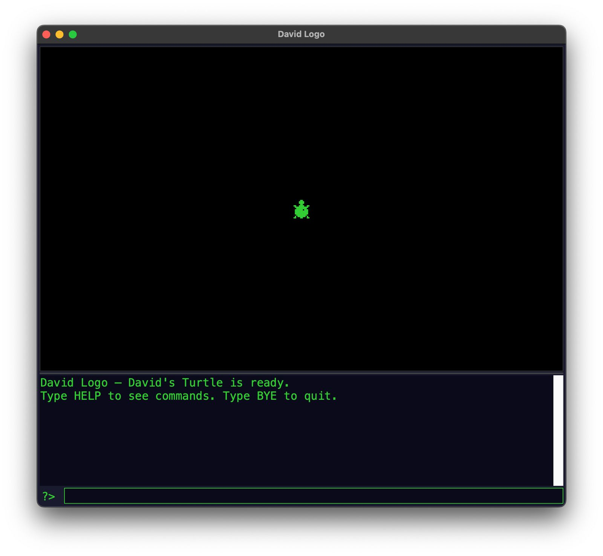

# Turtle Logo

> A Logo interpreter for kids — runs in the browser and as a desktop app.

## Try It

**[Play in your browser](https://hiribarne.github.io/turtle-logo/play/)** — no install needed.

**[Read the Turtle Book](https://hiribarne.github.io/turtle-logo/book/)** — a 20-chapter interactive tutorial with runnable code blocks.

## About

I grew up with MSX Logo in the 1980s — typing `FD 100 RT 90` and watching a turtle draw squares on the screen. It's how I first understood what an angle was.

My son David is in first grade, learning geometry. I wanted to give him the same experience I had: a simple command line, a turtle that listens, and the thrill of making shapes appear on screen by typing code.

Turtle Logo is my attempt to recreate that. It comes in two forms:

- **Website** — a browser-based interpreter and interactive tutorial, hosted on GitHub Pages
- **Desktop app** — a single Python script with a tkinter GUI, like the original MSX Logo



## Website

The website at [hiribarne.github.io/turtle-logo](https://hiribarne.github.io/turtle-logo/) has three parts:

- **Playground** (`/play/`) — full interpreter with command input, history, shape editor, and localStorage persistence
- **The Turtle Book** (`/book/`) — 20 chapters with interactive code blocks. Each chapter has a shared interpreter with a sticky canvas; you can run commands one at a time or all at once. Procedures persist across chapters.
- **Landing page** — links to both

### Building the site

```bash
cd site
npm install
npm run build     # outputs to docs/
npm run dev       # local dev server at localhost:8080
```

## Desktop App

```bash
python3 logo.py
```

Requires Python 3 with tkinter. On Raspberry Pi OS and most Linux distributions this is included by default. On macOS with Homebrew: `brew install python-tk@3.14` (match your Python version).

## Commands

| Command | What It Does |
|---|---|
| FD 50 | Forward 50 steps |
| BK 50 | Back 50 steps |
| RT 90 | Turn right 90° |
| LT 90 | Turn left 90° |
| REPEAT 4 [FD 50 RT 90] | Repeat commands |
| CS | Clear screen |
| PU / PD | Pen up / Pen down |
| SETPC 1 | Set pen color (0–11) |
| SETBG 0 | Set background color (0–15) |
| SETWIDTH 3 | Set line thickness |
| HOME | Go to center |
| HT / ST | Hide / Show turtle |
| POS | Show turtle position and heading |
| TO name ... END | Define a procedure |
| FORGET name | Delete a procedure |
| PROCS | List saved procedures |
| EDITSHAPE name | Design a turtle sprite |
| SETSHAPE name | Use a saved shape |
| SHAPES | List saved shapes |
| DEMO | Watch a colorful pattern |
| HELP | See all commands |
| BYE | Quit |

## The Turtle Book

A 20-chapter tutorial that starts with "Meet the Turtle" and builds up through squares, triangles, the shape rule (turn = 360 / sides), colors, procedures with variables, and designing custom turtle sprites. Written for a first grader who reads well.

Available as:
- **[Interactive web version](https://hiribarne.github.io/turtle-logo/book/)** with runnable code blocks
- **[PDF](books/logo-book.pdf)** formatted for Lulu coil-bound printing (US Letter)
- **[Markdown source](books/logo-book.md)**

## Credits

- **Logo language** — Seymour Papert, Wally Feurzeig, Cynthia Solomon (MIT, 1967)
- **MSX Logo** — Logo Computer Systems Inc. / LCSI (Microsoft/ASCII Corporation, 1980s)
- **Turtle Logo** — Roberto Hiribarne, 2026

## License

MIT License. See [LICENSE](LICENSE).
