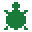

# El Libro de la Tortuga
### Aprende a Dibujar con Turtle Logo

*Para David*

---

<div class="copyright">
<p>Turtle Logo — El Libro de la Tortuga</p>
<p>Copyright © 2026</p>
<p>Para uso personal y educativo.</p>
<p>Hecho con   para David.</p>
</div>

## Conoce a la Tortuga

Hay una tortuga en tu pantalla.
Se llama Tu Tortuga.

La tortuga puede caminar.
La tortuga puede girar.
¡Cuando la tortuga camina, dibuja una línea!

Tú le dices a la tortuga qué hacer.
Escribes un comando en la parte de abajo de la pantalla.
Luego presionas **ENTER**.

¡La tortuga escucha y se mueve!

Vamos a intentarlo.

---

## Capítulo 1: Tus Primeros Pasos

Escribe esto y presiona ENTER:

```
AD 50
```

¡La tortuga avanzó 50 pasos!

**AD** quiere decir **ADELANTE** (es lo mismo que **FD** en inglés).
El número le dice a la tortuga qué tan lejos ir.

Prueba estos uno a la vez:

```
AD 100
AD 10
AD 200
```

¿Qué pasa cuando el número es más grande?
¡La tortuga llega más lejos!

---

Ahora prueba ir hacia atrás:

```
AT 50
```

**AT** quiere decir **ATRÁS** (es lo mismo que **BK** en inglés).

La tortuga camina hacia atrás, pero sigue mirando en la misma dirección.

---

## Capítulo 2: Gira la Tortuga

La tortuga también puede girar.

```
DE 90
```

**DE** quiere decir **girar a la DERECHA** (es lo mismo que **RT** en inglés).
**90** es un número de grados.

¿Sabes qué son 90 grados?
Es un **ángulo recto** — como la esquina de un libro, una puerta o tu escritorio.

Ahora prueba:

```
IZ 90
```

**IZ** quiere decir **girar a la IZQUIERDA** (es lo mismo que **LT** en inglés).

Prueba otros giros:

```
DE 45
```

Eso es la mitad de un ángulo recto.

```
DE 180
```

¡Eso gira a la tortuga completamente para que mire en la dirección opuesta!

---

## Capítulo 3: Dibuja una L

Vamos a dibujar una forma.

Primero, limpia la pantalla:

```
BP
```

**BP** quiere decir **BORRAPANTALLA** (es lo mismo que **CS** en inglés). Borra todo y manda a la tortuga de vuelta al centro.

Ahora escribe estos uno a la vez:

```
AD 100
DE 90
AD 100
```

¡Hiciste una forma de **L**!

La tortuga subió, giró a la derecha y avanzó.

---

## Capítulo 4: Un Cuadrado

Un cuadrado tiene **4 lados**.
Todos los lados miden lo mismo.
Cada esquina es un **ángulo recto** — o sea **90 grados**.

Primero limpia la pantalla:

```
BP
```

Ahora escribe estos uno a la vez:

```
AD 80
DE 90
AD 80
DE 90
AD 80
DE 90
AD 80
DE 90
```

¡Dibujaste un cuadrado!

¿Viste el patrón?
**AD 80** y luego **DE 90** — lo hiciste cuatro veces.

---

## Capítulo 5: REPETIR

Escribir lo mismo cuatro veces es mucho trabajo.

Logo tiene un atajo que se llama **REPETIR** (es lo mismo que **REPEAT** en inglés).

```
BP
REPETIR 4 [AD 80 DE 90]
```

¡Eso dibuja el mismo cuadrado — en una sola línea!

Así funciona **REPETIR**:
- El **número** dice cuántas veces.
- Los **[ ]** tienen los comandos que se repiten.

Prueba un cuadrado grande:

```
BP
REPETIR 4 [AD 150 DE 90]
```

Prueba un cuadrado chiquito:

```
BP
REPETIR 4 [AD 30 DE 90]
```

---

## Capítulo 6: Un Triángulo

Un triángulo tiene **3 lados**.

¿Cuánto debe girar la tortuga en cada esquina?

Piénsalo: una vuelta completa son **360 grados**.
Si giramos 3 veces, cada giro es **360 ÷ 3 = 120 grados**.

```
BP
REPETIR 3 [AD 80 DE 120]
```

¡Dibujaste un triángulo!

---

## Capítulo 7: La Regla de las Formas

Acabas de aprender algo importante.

Para dibujar cualquier forma, la tortuga necesita girar un total de **360 grados**.

Entonces el giro en cada esquina es:

**Giro = 360 ÷ número de lados**

¡Vamos a probarlo!

Un **pentágono** tiene 5 lados. 360 ÷ 5 = 72.

```
BP
REPETIR 5 [AD 60 DE 72]
```

Un **hexágono** tiene 6 lados. 360 ÷ 6 = 60.

```
BP
REPETIR 6 [AD 50 DE 60]
```

Un **octágono** tiene 8 lados. 360 ÷ 8 = 45.

```
BP
REPETIR 8 [AD 40 DE 45]
```

¿Ves el patrón? ¡Más lados = giro más pequeño = forma más redonda!

---

## Capítulo 8: Un Círculo (¡Casi!)

¿Qué pasa si usas MUCHOS lados con giros muy chiquitos?

```
BP
REPETIR 36 [AD 10 DE 10]
```

36 giros, 10 grados cada vez.
36 × 10 = 360 — ¡una vuelta completa!

¡Parece un círculo!

La tortuga no puede dibujar un círculo de verdad. Pero si usas suficientes pasitos, se ve igualito.

---

## Capítulo 9: Cambia los Colores

La tortuga siempre dibuja en verde.
¡Pero puedes cambiar el color!

```
FCOLORP 1
```

**FCOLORP** quiere decir **fijar color de pluma** (es lo mismo que **SETPC** en inglés).
El número elige un color.

Prueba estos:

- **FCOLORP 0** — blanco
- **FCOLORP 1** — rojo
- **FCOLORP 2** — verde
- **FCOLORP 3** — amarillo
- **FCOLORP 4** — cian (azul-verde)
- **FCOLORP 5** — rosa
- **FCOLORP 6** — naranja
- **FCOLORP 7** — azul cielo

Dibuja un cuadrado rojo:

```
BP
FCOLORP 1
REPETIR 4 [AD 80 DE 90]
```

Dibuja un triángulo amarillo:

```
BP
FCOLORP 3
REPETIR 3 [AD 80 DE 120]
```

---

## Capítulo 10: Colores de Fondo

¡También puedes cambiar el color del fondo!

```
FCOLORF 1
```

**FCOLORF** quiere decir **fijar color de fondo** (es lo mismo que **SETBG** en inglés).

Prueba estos:

- **FCOLORF 0** — negro (el normal)
- **FCOLORF 9** — azul
- **FCOLORF 15** — blanco
- **FCOLORF 14** — amarillo

Dibuja un copo de nieve blanco con fondo azul:

```
BP
FCOLORF 9
FCOLORP 0
REPETIR 6 [AD 80 AT 80 DE 60]
```

---

## Capítulo 11: Líneas Gruesas y Delgadas

Puedes hacer tus líneas más gruesas o más delgadas.

```
GROSOR 5
```

**GROSOR** ajusta qué tan grueso dibuja el lápiz.
El número es el ancho. ¡1 es delgado, 5 es grueso, 10 es muy grueso!

Prueba esto:

```
BP
GROSOR 1
AD 60
DE 90
GROSOR 5
AD 60
DE 90
GROSOR 10
AD 60
```

¡Tres líneas — delgada, mediana y gruesa!

---

## Capítulo 12: Levanta la Pluma

Cuando escribes **AD**, la tortuga siempre dibuja.

Pero a veces quieres mover sin dibujar.

**SP** quiere decir **SIN PLUMA** (es lo mismo que **PU** en inglés) — la tortuga se mueve pero no dibuja.
**CP** quiere decir **CON PLUMA** (es lo mismo que **PD** en inglés) — la tortuga vuelve a dibujar.

Prueba esto:

```
BP
AD 50
SP
AD 30
CP
AD 50
```

¡Tienes una línea, un espacio y otra línea!

Así puedes dibujar formas que no están conectadas.

---

## Capítulo 13: Una Estrella

Una estrella tiene 5 puntas.

Para una estrella de cinco puntas, giramos **144 grados** cada vez.
(Ese es un número especial. Funciona porque 144 × 5 = 720, ¡que son dos vueltas completas!)

```
BP
FCOLORP 3
REPETIR 5 [AD 100 DE 144]
```

¡Una hermosa estrella amarilla!

---

## Capítulo 14: Mira la DEMO

¿Quieres ver algo increíble?

Escribe:

```
DEMO
```

¡Mira cómo la tortuga dibuja un patrón de colores!

La tortuga usa los mismos comandos que tú ya conoces.
Después de verla, intenta hacer tu propio patrón.

---

## Capítulo 15: Crea Tu Propio Comando

Esta es una de las cosas más geniales de Logo.
¡Puedes **enseñarle comandos nuevos**!

Vamos a enseñarle a Logo la palabra **CUADRADO**.

Escribe esto:

```
PARA CUADRADO
```

Logo dirá que está esperando. Ahora escribe el cuerpo:

```
REPETIR 4 [AD 80 DE 90]
```

Luego escribe:

```
FIN
```

**PARA...FIN** es lo mismo que **TO...END** en inglés.

¡Ahora prueba tu nuevo comando!

```
CUADRADO
```

¡La tortuga dibuja un cuadrado!
Acabas de crear una palabra nueva que Logo entiende.

Logo guarda tus comandos, así que la próxima vez que abras Turtle Logo, ¡**CUADRADO** seguirá funcionando!

---

## Capítulo 16: Un Comando con Tamaño

¿Y si quieres cuadrados de diferentes tamaños?

Puedes darle a tu comando una **variable**.
Una variable es como una caja que guarda un número.
Se escribe con dos puntos, así: **:TAMAÑO**.

Escribe esto:

```
PARA CUADRADO :TAMAÑO
REPETIR 4 [AD :TAMAÑO DE 90]
FIN
```

(Si Logo dice que ya conoce CUADRADO, escribe **OLVIDAR CUADRADO** primero y vuelve a intentar.)

Ahora prueba:

```
BP
CUADRADO 50
CUADRADO 100
CUADRADO 150
```

¡Tres cuadrados, tres tamaños — todo con un solo comando!

---

## Capítulo 17: Un Patrón

Vamos a juntar todo y hacer algo increíble.

Primero, asegúrate de tener CUADRADO:

```
PARA CUADRADO :TAMAÑO
REPETIR 4 [AD :TAMAÑO DE 90]
FIN
```

Ahora dibuja muchos cuadrados, girando un poquito cada vez:

```
BP
REPETIR 36 [CUADRADO 80 DE 10]
```

¡Guau! ¡Un patrón hermoso hecho de 36 cuadrados!

Prueba cambiar los colores:

```
BP
FCOLORP 1
REPETIR 18 [CUADRADO 80 DE 20]
FCOLORP 4
REPETIR 18 [CUADRADO 60 DE 20]
```

---

## Capítulo 18: Esconder y Mostrar la Tortuga

A veces la tortuga estorba en tu dibujo.

```
OT
```

**OT** quiere decir **OCULTARTORTUGA** (es lo mismo que **HT** en inglés). La tortuga sigue ahí — solo que no la ves. ¡Sigue dibujando!

```
MT
```

**MT** quiere decir **MOSTRARTORTUGA** (es lo mismo que **ST** en inglés). Ahora la puedes ver otra vez.

Prueba esto:

```
BP
OT
REPETIR 36 [AD 10 DE 10]
MT
```

¡El círculo aparece sin que la tortuga tape la vista!

---

## Capítulo 19: Ve a Casa

Para mandar a la tortuga de vuelta al centro:

```
CENTRO
```

**CENTRO** es lo mismo que **HOME** en inglés. La tortuga va al centro y mira hacia arriba.
No borra nada.

Para saber dónde está la tortuga ahora, escribe:

```
POS
```

Te dirá la posición de la tortuga y hacia dónde está mirando.

---

## Capítulo 20: Diseña Tu Propia Tortuga

La tortuga está hecha de cuadritos — una cuadrícula de 16 por 16, ¡como arte de píxeles!

Puedes diseñar tu propia forma.

Escribe:

```
EDITARFORMA COHETE
```

Aparece una ventana con una cuadrícula.
Haz clic en los cuadritos para rellenarlos.
Arrastra para pintar.
Cuando termines, haz clic en **OK**.

¡Ahora la tortuga se ve como tu dibujo!

Para volver a la tortuga normal:

```
FIJARFORMA TORTUGA
```

Para usar tu forma de cohete otra vez:

```
FIJARFORMA COHETE
```

Para ver todas tus formas guardadas:

```
FORMAS
```

---

## Guía Rápida

| Español | English | Qué Hace |
|---|---|---|
| AD 50 | FD 50 | Adelante 50 pasos |
| AT 50 | BK 50 | Atrás 50 pasos |
| DE 90 | RT 90 | Girar a la derecha 90 grados |
| IZ 90 | LT 90 | Girar a la izquierda 90 grados |
| REPETIR 4 [AD 50 DE 90] | REPEAT 4 [FD 50 RT 90] | Repetir comandos |
| BP | CS | Borrar pantalla |
| SP | PU | Sin pluma (no dibuja) |
| CP | PD | Con pluma (dibuja) |
| FCOLORP 1 | SETPC 1 | Color de pluma (0-11) |
| FCOLORF 0 | SETBG 0 | Color de fondo (0-15) |
| GROSOR 3 | SETWIDTH 3 | Grosor de línea |
| CENTRO | HOME | Ir al centro |
| OT / MT | HT / ST | Ocultar / Mostrar tortuga |
| POS | POS | ¿Dónde está la tortuga? |
| PARA nombre ... FIN | TO name ... END | Crear un comando nuevo |
| OLVIDAR nombre | FORGET name | Olvidar un comando que hiciste |
| PROCEDIMIENTOS | PROCS | Lista de tus comandos |
| EDITARFORMA nombre | EDITSHAPE name | Diseñar una forma nueva |
| FIJARFORMA nombre | SETSHAPE name | Usar una forma guardada |
| FORMAS | SHAPES | Lista de formas guardadas |
| DEMO | DEMO | Ver un patrón genial |
| AYUDA | HELP | Ver todos los comandos |
| ADIOS | BYE | Salir |

---

## Guía de Formas

| Forma | Lados | Giro |
|---|---|---|
| Triángulo | 3 | 120° |
| Cuadrado | 4 | 90° |
| Pentágono | 5 | 72° |
| Hexágono | 6 | 60° |
| Octágono | 8 | 45° |
| Círculo (casi) | 36 | 10° |

**La regla:** Giro = 360 ÷ número de lados

---

## Cosas para Probar

1. Dibuja una **casa**. (¡Un cuadrado con un triángulo encima! Pista: después del cuadrado, necesitas mover la tortuga al lugar correcto y girar antes de dibujar el triángulo.)
2. Dibuja la letra **D** — ¡de David!
3. Dibuja un **arcoíris**. (Usa SP y CP para moverte entre arcos. Usa FCOLORP para cambiar colores. Un arco de arcoíris es medio círculo.)
4. Haz un **copo de nieve**. (Pista: REPETIR 6 con ramas que van hacia afuera y regresan.)
5. ¡Diseña una tortuga con forma de **nave espacial** con EDITARFORMA y vuela por la pantalla!
6. ¿Qué dibuja `REPETIR 8 [AD 60 DE 45]`?
7. ¿Qué dibuja `REPETIR 5 [REPETIR 4 [AD 40 DE 90] DE 72]`? (¡Un REPETIR dentro de otro REPETIR!)
8. Dibuja un **círculo perfecto**: `REPETIR 360 [AD 1 DE 1]` — 360 pasitos, 1 grado cada uno. ¡Lo más cerca de un círculo perfecto!

---

*¡Feliz dibujo!*
